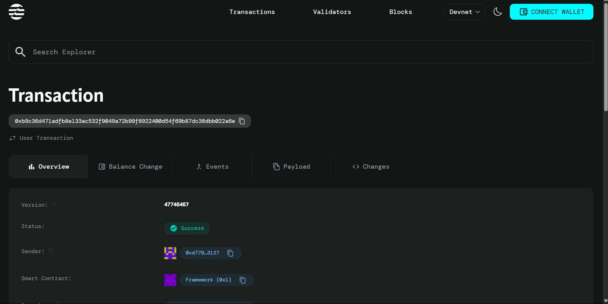

# Sports Results Oracle

## Project Description

The Sports Results Oracle is a decentralized smart contract built on the Aptos blockchain that provides reliable and tamper-proof sports outcome verification for betting applications. This oracle system ensures that sports match results are accurately recorded and verified on-chain, enabling trustless betting platforms to automatically settle bets based on real-world sports outcomes.

The contract serves as a bridge between off-chain sports data and on-chain betting applications, maintaining the integrity and transparency required for decentralized sports betting ecosystems.

## Project Vision

Our vision is to create a decentralized, transparent, and reliable infrastructure for sports outcome verification that eliminates the need for centralized authorities in sports betting. By leveraging blockchain technology, we aim to:

- **Eliminate Trust Issues**: Remove the need to trust centralized betting platforms with result verification
- **Ensure Transparency**: Make all sports results publicly verifiable and immutable
- **Enable Innovation**: Provide a foundation for next-generation decentralized betting applications
- **Promote Fair Play**: Ensure that all participants have access to the same verified information
- **Build Ecosystem**: Create a robust infrastructure that can support various sports and betting mechanisms

## Key Features

### 🔐 **Authorized Oracle System**
- Only verified oracle addresses can submit sports results
- Prevents unauthorized result manipulation
- Maintains data integrity through access control

### 📊 **Comprehensive Match Data**
- Records complete match information including team names, scores, and timestamps
- Supports various sports formats and scoring systems
- Immutable storage ensures results cannot be altered after submission

### ⏱️ **Real-time Result Verification**
- Timestamped results provide chronological accuracy
- Finalization status ensures betting platforms know when results are official
- Quick verification process for immediate bet settlement

### 🛡️ **Security First Design**
- Built-in error handling for various edge cases
- Oracle authorization prevents unauthorized access
- Transparent and auditable code structure

### 🌐 **Blockchain Native**
- Fully decentralized operation on Aptos blockchain
- Gas-efficient operations for cost-effective usage
- Interoperable with other DeFi and betting protocols

## Future Scope

### 🚀 **Enhanced Features**
- **Multi-Oracle Support**: Implement consensus mechanisms with multiple oracle sources
- **Automated Result Fetching**: Integration with sports APIs for real-time data feeds
- **Result Validation**: Cross-reference multiple data sources for accuracy
- **Historical Data**: Comprehensive storage and querying of historical match results

### 🎯 **Expanded Sports Coverage**
- **Multiple Sports**: Support for football, basketball, baseball, soccer, and more
- **Tournament Support**: Bracket-style tournaments and championship tracking
- **Live Scoring**: Real-time score updates during ongoing matches
- **Statistical Data**: Player statistics and advanced game metrics

### 🔧 **Technical Improvements**
- **Governance Module**: Community-driven oracle selection and management
- **Reward System**: Incentivize accurate and timely result submissions
- **Slashing Mechanism**: Penalize oracles for submitting incorrect information
- **API Integration**: RESTful APIs for easy integration with external applications

### 🌍 **Ecosystem Integration**
- **Betting Platform SDK**: Easy integration tools for betting applications
- **Cross-chain Support**: Bridge to other blockchain networks
- **DeFi Integration**: Liquidity pools and yield farming for oracle tokens
- **Mobile Applications**: User-friendly mobile apps for result verification

### 📈 **Scalability & Performance**
- **Layer 2 Solutions**: Implementation on scaling solutions for reduced costs
- **Batch Processing**: Efficient handling of multiple match results
- **Caching Mechanisms**: Optimized data retrieval for frequently accessed results
- **Analytics Dashboard**: Comprehensive insights and reporting tools

## Contract Details
0x8C9C95A830b7E7e86f2f12DB88e911499A6f695f
